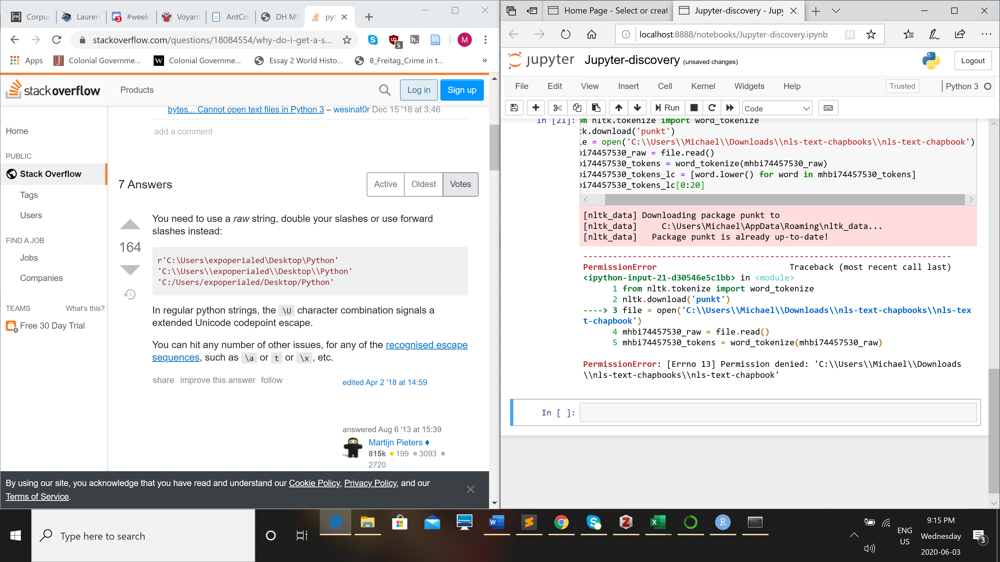

So I started with module 1, Excel and R.
I started off with some issues with downloading the csv file from the webpage. I right clicked and ended up downloading all of the data from the page. I reached out in our discord and got the link from Dr. Graham to te .csv file. 
From there I unzipped the data, loaded imported the file into excel and filtered for results for the Ottawa and Gatineau area (Ottawa side only) under filter in 'Geo name'. 
Wrote =SUM(P15500:P15503) in P15500 and got the sum of 20780. 
highlighted those cells and ctrl highlighted the catagories age 1-4
Inserted a chart and fiddled aroud with the interfaces and got the graph looking the way I wanted

I then moved on to plotting in Rstudio.
I cannot open it from Anaconda Powershell so I access it through my machines search. 
Open, and create a new R script.
I then used the commands provided to us
install.packages("RCurl")
library("RCurl")
Run
I moved on to grab the table of data using : x <- getURL("https://raw.githubusercontent.com/shawngraham/exercise/gh-pages/CND.csv", .opts = list(ssl.verifypeer = FALSE))
no issues there.
I extracted the data using : documents <- read.csv(text = x, col.names=c("Article_ID", "Newspaper Title", "Newspaper City", "Newspaper Province", "Newspaper Country", "Year", "Month", "Day", "Article Type", "Text", "Keywords"), colClasses=rep("character", 3), sep=",", quote="")
I counted the documents using : counts <- table(documents$Newspaper.City)
counts
got : 27, 1, 181, 143, 5, 1
I then plotted the years into a graph and got this image

when it comes to resolving the issue with the typo 'edinbough' I would run the dta through on of the cleaning methods we discussed in last weeks class and combine in into the proper spelling.
I moved onto Voyant. I was unable to access the site trough the link in out module so I reached out and got a link to a backup site I guess from Dr. Graham : https://service.sadilar.org/voyant/
From There I was able to continue on with the rest of the portion of the module copying the data we were given, putting the URL into voyant and changing the table setting before revealing the corpus. The id to the corpus I created is below: 49f48aa297f23faaecb77e664a9f0650. I did not copy the whole URL however I was able to find it using the id : https://service.sadilar.org/voyant/?corpus=49f48aa297f23faaecb77e664a9f0650
I browsed the different settings you can use in voyant and was asking myself along the way about how the information in these articles was relayed to the general public as it was newspapers we were looking at. I found that there was a lot of discussion about the places and not so much people. It makes me believe the information was put forth this way to create a sense of community and togetherness.
We were asked to create an HTML of our word cloud: 
<iframe style='width: 509px; height: 304px;' src='https://service.sadilar.org/voyant/tool/Cirrus/
corpus=49f48aa297f23faaecb77e664a9f0650'></iframe>
This HTMl is after I stopped a lot of words, most of which were typos and unimportant words like the, and or he.
From there I began the challenging part of this week.
Asked to create our own set of data from week twos instructions and I did that. At first I needed to figure out what I wanted to collect articles on and I decided to look at articles with the key phrase 'world war two'
Origionally I was trying to use the first method of gathering data using the URL for the search page however I was unsucessful and wound up downloading information onto my computer I did not need. 
I took a step back and read through all of week 2 and found that my best bet was to use the same method we used in find the articles for 'archeology'
I used the codes that we had in week two and subbed out line 17 for 'world war two' as the search result
#!/usr/bin/env python
"""
a script for getting materials from the Chronicling America website
"""

#Make these modules available
import requests
import json

__author__ = "michael"

api_search_url = 'https://chroniclingamerica.loc.gov/search/pages/results/'

params = {
    'proxtext': 'world war two' # Search for this keyword
}

params['format'] = 'json'

response = requests.get(api_search_url, params=params)

print('Here\'s the formatted url that gets sent to the ChronAmerca API:\n{}\n'.format(response.url))

if response.status_code == requests.codes.ok:
    print('All ok')
elif response.status_code == 403:
    print('There was an authentication error. Did you paste your API above?')
else:
    print('There was a problem. Error code: {}'.format(response.status_code))

data = response.json()

from pygments import highlight, lexers, formatters

formatted_data = json.dumps(data, indent=2)

highlighted_data = highlight(formatted_data, lexers.JsonLexer(), formatters.TerminalFormatter())

print(highlighted_data)

with open('data.json', 'w') as outfile:
    json.dump(data, outfile)
I put this code into a Sublime text file, Saved as a .py and then used python to run the command and extract the data I needed. I ended up only getting the first 20 results from the search but I had spent some time already trying to figure out which method to use so I decided to move on. I am definitely wondering what I could have done differently to get all 6000+ records but I felt that I was ablt to draw some conclusions from the inormation I gathered.
I then used the json-csv convertor we used for week 2 as well, downloaded my file as a .xlsx and uploaded it into Voyant.
Going into the voyant parousing I was trying to see how the war was actually translated to the people in America. during the time of world war two obviously it was not as easy to get information about what is happening around the world as it is now with the advent of the internet so I was curious to see what key words jumped out. After filtering out the jumbled misspelled words I was able to find the most used words.
Looking back I definietly would have like to gather more data and also cleaned it up before putting it through voyant and I will definitely remember that for the future.
I found that most of the words used had to do with what we typically gather from Americans when fighting. Uplifting and positive, with the top two words used "new" "world". Factoring in my knowledge of the war and what Research I have already done on the topic this was actually unsurprising because it is very unlikely they would have discussed the devestation the war actually was creating. 
The ID and URL to the Corpus is : https://service.sadilar.org/voyant/?corpus=44f12a2130e72a30a2310e8d5de87f9e
All in all I enjoyed this excersize and will definietly use it in the future. 
The next portion of this week had to do with antconc. 
I followed the instructions for instillation and beginning with success and moved on to the meat of the assignment. 
I downloaded the files provided for us and tried uploadding them into the tool. I could not find the files at first and realized I had not unzipped them. I then ran into the issue of how to get all of those files into one place as I was using it (open file). I dug around and realized you could open a directory and just like that I was able to get them all into the application in minutes.
From there I browsed the information searching for different keywords and it was really cool to be able to zone in on certain things in such a large amount of data. I will again be keeping this tool in my arsenal.
The last part to this was using jupyter. I followed along with this instructions in the jupyter notebook by Beatrice Alex and Got most of the way through. everything was sucessful in the tests she told you to put through and it was interesting to learn that there is another path you can take. 
When we got to the actual meat of the activity however I ran into syntax error after syntax error and chose to step away and move on to the next task. 
I did screenshot the error and did some online searching for solutions and the most suggested solution was to run the program as an admin and I am still nervous about opening that back door on my PC
The screenshot is:

Moving onto the final portion of this weeks work to topic models. 
This area interested me as it was something with computers I had heard about before but never knew what it ws about.
I began by watching the video, I then attempted to download the topic modelling tool and it downloaded an empty zip file. I deleted and tried to download again with the same result. I messaged in the group chat to see if anyone had answers. It seems as though mac users had a similar issue but unfortunatley I have a PC so I had to find an alternative solution.
I was able to get the file from a fellow student and downloaded, unzipped and opened succesfully. 
I wasablr to import my data and export the Html files with no issues. Once these files were exported I moved on to flipping through the index to see what I could find. I chose to look at 10 topics. It was interesting to see the possibilities of the data I had created. I them moved on to making some visualizations
I opened te .csv file according to Wallace's instructions and edited out the path for the documents using the find and replace function in excel. I then created a pie chart for row 3 to see how relevant this was to the topics I had searched for. The end result of the chart is below:

From this data I coulndn't really deduce any information however I feel if I had a more targeted data set and a smaller data set the function of creating the chart would have been more effective.
After reading through Wallace and Enderle's articles I can see that topic modeling is very good when tracking trend and has great use in both large scale data sets and small scale data sets especially with the options you have to search and find throughout the document. Some of the information I feel that could have been more helpful in this is titles of the topics rater than just teh top words associated with the topics. 
I moved on to R studio. I began by creating my folder : chapbooks-r and moving chapbooks-text.csv into said folder. I then created a new project in this directory
I then installed the packages
install.packages('tidyverse')
install.packages('tidytext')
and created and tidied more data using:
#slightly modified version of
#https://tm4ss.github.io/docs/Tutorial_6_Topic_Models.html
#by Andreas Niekler, Gregor Wiedemann

#libraries
library(tidyverse)
library(tidytext)

#load, clean, and get data into shape

#cb = chapbooks
cb  <- read_csv("chapbooks-text.csv")

#put the data into a tibble (data structure for tidytext)
#we are also telling R what kind of data is in the 'text',
#'line', and 'data' columns in our original csv.
#we are also stripping out all the digits from the text column

cb_df <- tibble(id = cb$line, text = (str_remove_all(cb$text, "[0-9]")), date = cb$date)

#turn cb_df into tidy format
#use `View(cb_df)` to see the difference
#from the previous table

tidy_cb <- cb_df %>%
  unnest_tokens(word, text)

#the only time filtering happens
#load up the default list of stop_words that comes
#with the tidyverse

data(stop_words)

#delete stopwords from our data
tidy_cb <- tidy_cb %>%
  anti_join(stop_words)
 
 Running each line one by one
 I then typed cb to see what my data looks like and cb_df and tidy_cb to change the way the data is presented.
 I then ran the next set of commands in our instructions:
 #this line might take a few moments to run btw
cb_words <- tidy_cb %>%
  count(id, word, sort = TRUE)

#take a look at what you've just done
#by examining the first few lines of `cb_words`

head(cb_words)

#already, you start to get a sense of what's in this dataset...

#turn that into a matrix
dtm <- cb_words %>%
  cast_dtm(id, word, n)
 The last command gave me an error that there is no package called 'tm'
 I am unsure what this error means so I am going to see if there is anyone else who has ran into this error
 Nadia had the same issue so I followed the instructions to the solution:
 install.packages("tm")
 library(tm)
 and it worked.
 ran into another issue when running the next set of commands to create a topic model:
 require(topicmodels)
#number of topics
K <- 15
#set random number generator seed
#for purposes of reproducibility
set.seed(9161)
#compute the LDA model, inference via 1000 iterations of Gibbs sampling
topicModel <- LDA(dtm, K, method="Gibbs", control=list(iter = 500, verbose = 25))
it says could not find function "LDA", I will look in our group again to see if anyone had this issue
 found a couple people with the same issue, used:
 install.packages('topicmodels')
then ran the code from require(topicmodels)
and it is loading
It was successful
moving on
#have a look a some of the results (posterior distributions)
tmResult <- posterior(topicModel)

#format of the resulting object
attributes(tmResult)

#lengthOfVocab
ncol(dtm)

#topics are probability distributions over the entire vocabulary
beta <- tmResult$terms   # get beta from results
dim(beta)

#for every document we have a probability distribution of its contained topics
theta <- tmResult$topics
dim(theta)        

top5termsPerTopic <- terms(topicModel, 5)
topicNames <- apply(top5termsPerTopic, 2, paste, collapse=" ")
topicNames
In regards to were to change the number of topics you can do this in line 18 or in regards to where it is in the git line 201. This will change from 5 to 10
the next portion of code:
#load libraries for visualization
library("reshape2")
library("ggplot2")

#select some documents for the purposes of
#sample visualizations
#here, the 2nd, 100th, and 200th document
#in our corpus

exampleIds <- c(2, 100, 200)

N <- length(exampleIds)
#get topic proportions form example documents
topicProportionExamples <- theta[exampleIds,]
colnames(topicProportionExamples) <- topicNames

#put the data into a dataframe just for our visualization
vizDataFrame <- melt(cbind(data.frame(topicProportionExamples), document = factor(1:N)), variable.name = "topic", id.vars = "document")  

#specify the geometry, aesthetics, and data for a plot
ggplot(data = vizDataFrame, aes(topic, value, fill = document), ylab = "proportion") +
  geom_bar(stat="identity") +
  theme(axis.text.x = element_text(angle = 90, hjust = 1)) +  
  coord_flip() +
  facet_wrap(~ document, ncol = N)
  success and now to visualize the toics over time:
  cb$decade <- paste0(substr(cb$date, 0, 3), "0")
#get mean topic proportions per decade
topic_proportion_per_decade <- aggregate(theta, by = list(decade = cb$decade), mean)
#set topic names to aggregated columns
colnames(topic_proportion_per_decade)[2:(K+1)] <- topicNames

#reshape data frame, for when I get the topics over time thing sorted
vizDataFrame <- melt(topic_proportion_per_decade, id.vars = "decade")

#plot topic proportions per deacde as bar plot
require(pals)
ggplot(vizDataFrame, aes(x=decade, y=value, fill=variable)) +
  geom_bar(stat = "identity") + ylab("proportion") +
  scale_fill_manual(values = paste0(alphabet(20), "FF"), name = "decade") +
  theme(axis.text.x = element_text(angle = 90, hjust = 1))
 I had an error message pop up that it could not find funtion 'Alphabet'
 I will again check if anyone has had this issue
 I used # in front of te line in which alphaet is used and it worked for tat issue now I have an issue were there is no package called pals. I will again look and see
 I installed pals and it worked. 
 I tried with different values and it is definietly interesting how much a minute change in the code can make to the topic model.
 My final topic model which was created using the origianal code looks like this:
 
 I chose this week again to skip the bonus as the majority of my historical research is text based, however as with previous weeks I will be reading through and attempting some of the activities when I have extra time
